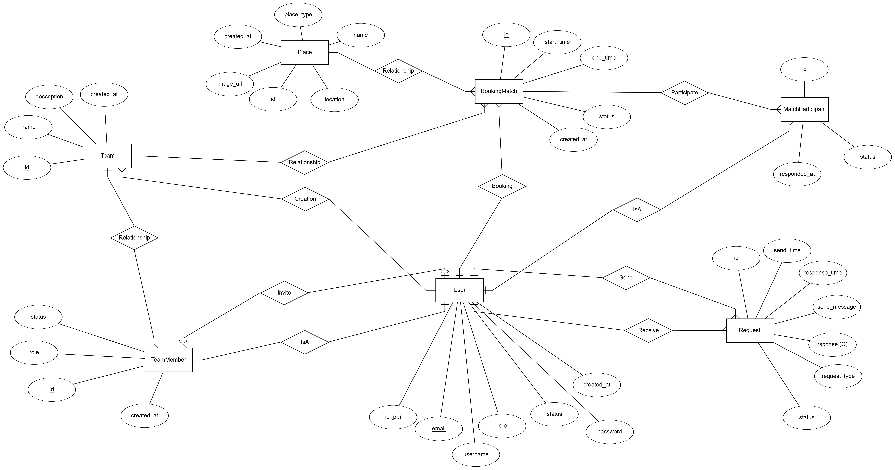
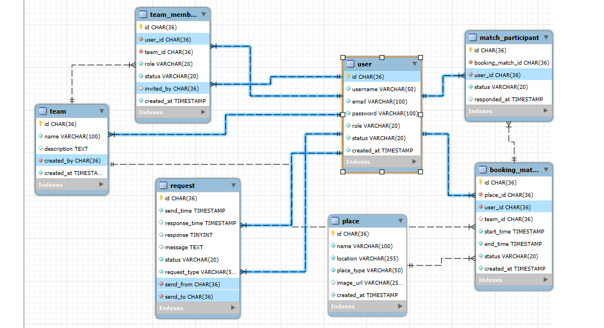
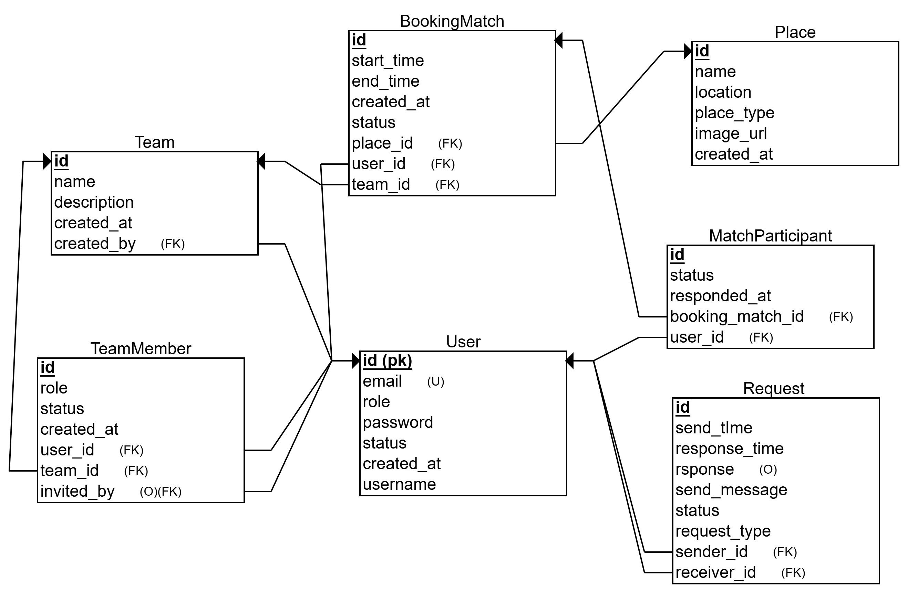

# ⚽ Football Places Booking System - Backend

<div align="center">


A comprehensive Spring Boot REST API system for managing football field bookings, team management, and match organization.

</div>

---

## 📋 Table of Contents

- [🎯 Overview](#🎯-overview)
- [✨ Features](#✨-features)
- [🏗️ Architecture](#🏗️-architecture)
- [🗄️ Database Design](#🗄️-database-design)
- [🛠️ Technologies Used](#🛠️-technologies-used)
- [⚡ Installation](#⚡-installation)
- [🐳 Docker Deployment](#🐳-docker-deployment)
- [📚 API Documentation](#📚-api-documentation)
- [🔧 Configuration](#🔧-configuration)
- [🤝 Contributing](#🤝-contributing)

---

## 🎯 Overview

The **Football Places Booking System** is a comprehensive backend solution designed to facilitate football field reservations, team management, and match organization. Built with **Spring Boot 3.5.3** and **Java 21**, this system provides a robust REST API for managing users, teams, bookings, and real-time match coordination.

### Key Capabilities
- 🏟️ **Field Management**: Comprehensive football venue management system
- 👥 **Team Organization**: Create and manage teams with member hierarchies  
- 📅 **Match Booking**: Schedule and coordinate football matches
- 🔐 **Secure Authentication**: JWT-based security with role-based access control
- 📧 **Email Notifications**: Automated email system for invitations and updates
- 🔄 **Real-time Updates**: WebSocket support for live match coordination

---

## ✨ Features

### 🔐 Authentication & Authorization
- **JWT Token Authentication** with secure user sessions
- **Role-based Access Control** (Admin, User roles)
- **User Registration & Login** with email verification
- **Password Security** with BCrypt encryption

### 👥 User Management
- **User Profile Management** with status tracking (Active, Inactive, Banned)
- **User Search & Filtering** with pagination support
- **Account Verification** and password management

### 🏟️ Place Management
- **Football Venue Registration** with detailed information
- **Place Types Support** (Indoor, Outdoor, Hybrid fields)
- **Location-based Search** and filtering capabilities
- **Image Management** for venue visualization

### 👨‍👩‍👧‍👦 Team Management
- **Team Creation & Management** by organizers
- **Team Member Invitation System** with acceptance/rejection workflow
- **Role-based Team Hierarchy** (Organizer, Members)
- **Team Join Requests** with approval system

### 📅 Match Booking & Coordination
- **Match Scheduling** with time slot management
- **Match Participant Management** with invitation system
- **Match Status Tracking** (Pending, Confirmed, Cancelled, Completed)
- **Calendar View** for upcoming and past matches

### 📨 Request & Notification System
- **Team Invitation Requests** with automated workflows
- **Match Participation Invitations** 
- **Email Notification System** with HTML templates
- **Request Status Management** (Pending, Accepted, Rejected)

### 🔄 Real-time Features
- **WebSocket Integration** for live updates
- **Real-time Match Coordination**
- **Live Booking Status Updates**

---

## 🏗️ Architecture

### System Architecture
```
┌─────────────────┐    ┌──────────────────┐    ┌─────────────────┐
│   Frontend      │────│   REST API       │────│   Database      │
│   (Client)      │    │   Spring Boot    │    │   PostgreSQL    │
└─────────────────┘    └──────────────────┘    └─────────────────┘
                              │
                       ┌──────────────────┐
                       │   Email Service  │
                       │   SMTP Gmail     │
                       └──────────────────┘
```

### Package Structure
```
src/main/java/hypercell/final_project/football_places_booking_system/
├── 📁 controller/          # REST API Controllers
├── 📁 service/            # Business Logic Layer
│   ├── Interfaces/        # Service Interfaces
│   └── Impl/             # Service Implementations
├── 📁 repository/         # Data Access Layer (JPA Repositories)
├── 📁 model/             # Data Models
│   ├── db/               # JPA Entities
│   ├── dto/              # Data Transfer Objects
│   └── enums/            # Enumeration Classes
├── 📁 security/          # Security Configuration
├── 📁 config/            # Application Configuration
└── 📁 exception/         # Custom Exception Handlers
```

---

## 🗄️ Database Design

The system uses **PostgreSQL** as the primary database with **JPA/Hibernate** for ORM mapping. Database migrations are managed through **Liquibase** change logs.

### Entity Relationship Diagram

<div align="center">


*Complete Entity Relationship Diagram*


*MySQL Entity Relationship Format*


*Relational Entity Structure*

</div>

### Core Entities

#### 👤 User Entity
```java
- id: UUID (Primary Key)
- username: String (Unique)
- email: String (Unique)
- password: String (Encrypted)
- role: UserRole (ADMIN, USER)
- status: UserStatus (ACTIVE, INACTIVE, BANNED)
- createdAt, updatedAt: Timestamps
```

#### 🏟️ Place Entity
```java
- id: UUID (Primary Key)
- name: String
- description: String
- location: String
- placeType: PlaceType (INDOOR, OUTDOOR, HYBRID)
- imageUrl: String
```

#### 👥 Team Entity
```java
- id: UUID (Primary Key)
- name: String (Unique)
- description: String
- creator: User (Foreign Key)
- teamMembers: List<TeamMember>
- bookingMatches: List<BookingMatch>
```

#### 📅 BookingMatch Entity
```java
- id: UUID (Primary Key)
- startTime: LocalDateTime
- endTime: LocalDateTime
- status: MatchStatus
- place: Place (Foreign Key)
- user: User (Foreign Key)
- team: Team (Foreign Key)
- participants: List<MatchParticipant>
```

### Database Configuration

**JPA/Hibernate Configuration:**
```yaml
spring:
  jpa:
    hibernate:
      ddl-auto: update
    show-sql: true
    properties:
      hibernate:
        dialect: org.hibernate.dialect.PostgreSQLDialect
    database-platform: org.hibernate.dialect.PostgreSQLDialect
```

**Connection Settings:**
```yaml
spring:
  datasource:
    url: jdbc:postgresql://localhost:5432/footballPlayer
    username: postgres
    password: ${DB_PASSWORD}
    driver-class-name: org.postgresql.Driver
```

---

## 🛠️ Technologies Used

### Backend Framework
- **Java 21** - Latest LTS version with modern features
- **Spring Boot 3.5.3** - Enterprise-grade framework
- **Spring Security** - Authentication and authorization
- **Spring Data JPA** - Data persistence layer
- **Spring Web** - REST API development
- **Spring Mail** - Email service integration

### Database & ORM
- **PostgreSQL** - Primary relational database
- **Hibernate** - Object-Relational Mapping
- **Liquibase** - Database migration management
- **JPA Repositories** - Data access abstraction

### Security & Authentication
- **JWT (JSON Web Tokens)** - Stateless authentication
- **BCrypt** - Password hashing
- **Spring Security** - Comprehensive security framework

### Communication & Messaging
- **Spring WebSocket** - Real-time communication
- **JavaMail API** - Email notification system
- **Thymeleaf** - Email template engine

### Development & DevOps
- **Maven** - Dependency management and build automation
- **Docker & Docker Compose** - Containerization
- **Lombok** - Boilerplate code reduction
- **Spring Boot DevTools** - Development utilities

### Testing & Validation
- **Spring Boot Test** - Comprehensive testing framework
- **JUnit 5** - Unit testing
- **Spring Security Test** - Security testing
- **Bean Validation** - Input validation

---

## ⚡ Installation

### Prerequisites
- **Java 21** or higher
- **Maven 3.8+**
- **PostgreSQL 12+**
- **Docker** (optional, for containerized deployment)

### 1. Clone the Repository
```bash
git clone https://github.com/Football-Places-Booking-System/Football-Places-Booking-System-Backend.git
cd Football-Places-Booking-System-Backend/football-places-booking-system
```

### 2. Database Setup
Create a PostgreSQL database:
```sql
CREATE DATABASE footballPlayer;
CREATE USER postgres WITH PASSWORD 'your_password';
GRANT ALL PRIVILEGES ON DATABASE footballPlayer TO postgres;
```

### 3. Configuration
Copy the template configuration file:
```bash
cp src/main/resources/application-template.yml src/main/resources/application.yml
```

Update `application.yml` with your database credentials:
```yaml
spring:
  datasource:
    url: jdbc:postgresql://localhost:5432/footballPlayer
    username: postgres
    password: your_password

  mail:
    username: your_email@gmail.com
    password: your_app_password

app:
  security:
    jwt:
      secret-key: your_jwt_secret_key
```

### 4. Build and Run
```bash
# Install dependencies and build
mvn clean install

# Run the application
mvn spring-boot:run
```

The application will start on `http://localhost:8080`

---

## 🐳 Docker Deployment

### Quick Start with Docker Compose
```bash
# Build and start all services
docker-compose up --build

# Run in background
docker-compose up -d --build

# View logs
docker-compose logs -f

# Stop services
docker-compose down
```

### Manual Docker Build
```bash
# Build the JAR file
mvn clean package -DskipTests

# Build Docker image
docker build -t football-booking-system .

# Run with external PostgreSQL
docker run -p 8080:8080 \
  -e SPRING_DATASOURCE_URL=jdbc:postgresql://host.docker.internal:5432/footballPlayer \
  -e SPRING_DATASOURCE_USERNAME=postgres \
  -e SPRING_DATASOURCE_PASSWORD=your_password \
  football-booking-system
```

### Docker Configuration
The `docker-compose.yml` includes:
- **Spring Boot Application** (Port 8080)
- **PostgreSQL Database** (Port 5432)
- **Health Checks** for service dependencies
- **Volume Persistence** for database data
- **Network Configuration** for service communication

---

## 📚 API Documentation

### Base URL
```
http://localhost:8080/api
```

### Authentication Endpoints
```http
POST /auth/register          # User registration
POST /auth/login             # User login
```

### User Management
```http
GET    /users                # Get all users (Admin only)
GET    /users/{id}           # Get user by ID
PATCH  /users/{id}           # Update user
DELETE /users/{id}           # Delete user
POST   /users/check-password # Verify password
```

### Place Management
```http
GET    /place/all            # Get all places (with filtering)
GET    /place/{id}           # Get place by ID
POST   /place                # Create place (Admin only)
PATCH  /place/{id}           # Update place (Admin only)
DELETE /place/{id}           # Delete place (Admin only)
```

### Team Management
```http
GET    /teams                # Get all teams
GET    /teams/{id}           # Get team by ID
POST   /teams                # Create team
PATCH  /teams/{id}           # Update team
DELETE /teams/{id}           # Delete team
```

### Booking Management
```http
GET    /booking-matches      # Get all bookings
GET    /booking-matches/{id} # Get booking by ID
POST   /booking-matches      # Create booking
PATCH  /booking-matches/{id} # Update booking
DELETE /booking-matches/{id} # Cancel booking
```

### Request System
```http
GET    /requests/received    # Get received requests
GET    /requests/sent        # Get sent requests
POST   /requests             # Create request
PATCH  /requests/{id}        # Respond to request
```

### Authentication Headers
```http
Authorization: Bearer <jwt_token>
Content-Type: application/json
```

### Example API Calls

**User Registration:**
```bash
curl -X POST http://localhost:8080/api/auth/register \
  -H "Content-Type: application/json" \
  -d '{
    "username": "john_doe",
    "email": "john@example.com",
    "password": "securePassword123",
    "role": "USER"
  }'
```

**Create Team:**
```bash
curl -X POST http://localhost:8080/api/teams \
  -H "Authorization: Bearer <your_jwt_token>" \
  -H "Content-Type: application/json" \
  -d '{
    "name": "Arsenal FC",
    "description": "Professional football team"
  }'
```

---

## 🔧 Configuration

### Environment Variables
```bash
# Database Configuration
DB_URL=jdbc:postgresql://localhost:5432/footballPlayer
DB_USERNAME=postgres
DB_PASSWORD=your_password

# JWT Configuration
JWT_SECRET=your_jwt_secret_key
JWT_EXPIRATION=86400000

# Email Configuration
MAIL_USERNAME=your_email@gmail.com
MAIL_PASSWORD=your_app_password

# Server Configuration
SERVER_PORT=8080
```

### Profile-based Configuration
- **Development Profile**: `application-dev.yml`
- **Production Profile**: `application-prod.yml`
- **Test Profile**: `application-test.yml`

Run with specific profile:
```bash
mvn spring-boot:run -Dspring-boot.run.profiles=dev
```

---

## 🤝 Contributing

### Development Setup
1. Fork the repository
2. Create a feature branch: `git checkout -b feature/amazing-feature`
3. Make your changes and commit: `git commit -m 'Add amazing feature'`
4. Push to the branch: `git push origin feature/amazing-feature`
5. Open a Pull Request

### Code Style Guidelines
- Follow **Java 21** best practices
- Use **Lombok** for boilerplate code reduction
- Implement proper **exception handling**
- Write comprehensive **unit tests**
- Follow **REST API** conventions
- Document all **public methods**

### Pull Request Process
1. Ensure all tests pass: `mvn test`
2. Update documentation if needed
3. Add tests for new features
4. Follow the existing code style
5. Update the README if necessary

---

## 📝 License

This project is part of a final internship project developed for learning purposes.

---

## 👥 Team

Developed as part of HyperCell Final Project - Football Places Booking System

---

<div align="center">

**⚽ Ready to revolutionize football field booking? Get started now! ⚽**


</div>
